# [AI 기반 랙 운동 자세 추적 및 분석 프로젝트]

> 컴퓨터 비전과 AI 포즈 추정을 활용한 랙 기반 근력 운동 모션 트래킹 시스템

---

# 팀 구성 및 역할 분담

## 팀원 소개 및 역할

| 프로필 | 이름 | 담당 영역 | 핵심 책임 | 주요 개발 산출물 |
| :---: | :--- | :--- | :--- | :--- |
|  | **이&nbsp;현&nbsp;규** | Core / AI | 프로젝트 리드, 포즈 추정 파이프라인 설계 및 구현, 협업 시스템 구축 | PoseLandmarker 통합, 랙 추적 알고리즘, 문서 체계 수립 |
| — | **이&nbsp;지&nbsp;원** | | | |
| — | **장&nbsp;효&nbsp;인** | | | |
| — | **전&nbsp;효&nbsp;원** | | | |
| — | **신&nbsp;은&nbsp;수** | | | |

---

# 프로젝트 관리 (Collaboration & Process)

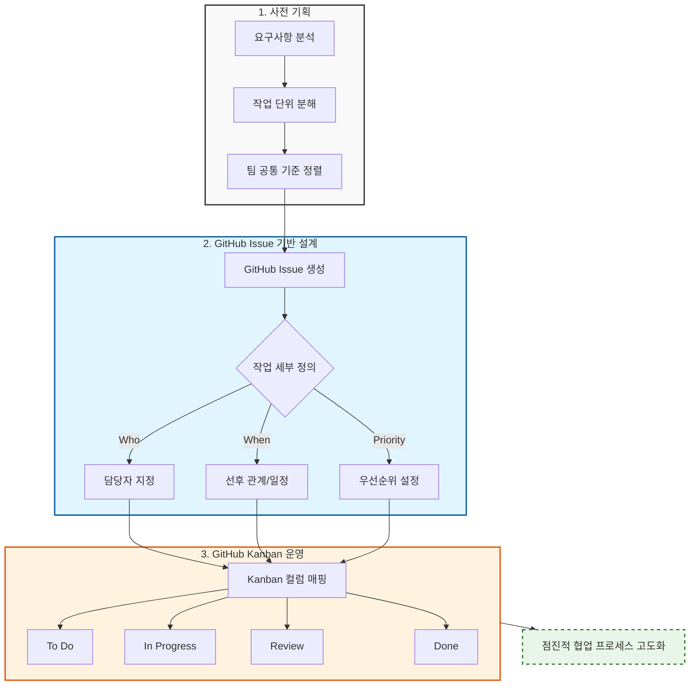
```mermaid
graph TD
    %% 1단계: 사전 기획
    subgraph Phase1 [1. 사전 기획]
        A[요구사항 분석] --> B[작업 단위 분해]
        B --> C[팀 공통 기준 정렬]
    end

    %% 2단계: GitHub Issues
    subgraph Phase2 [2. GitHub Issue 기반 설계]
        C --> D[GitHub Issue 생성]
        D --> E{작업 세부 정의}
        E -->|Who| E1[담당자 지정]
        E -->|When| E2[선후 관계/일정]
        E -->|Priority| E3[우선순위 설정]
    end

    %% 3단계: GitHub Kanban
    subgraph Phase3 [3. GitHub Kanban 운영]
        E1 & E2 & E3 --> F[Kanban 컬럼 매핑]
        F --> G1[To Do]
        F --> G2[In Progress]
        F --> G3[Review]
        F --> G4[Done]
    end

    Phase3 --> H[점진적 협업 프로세스 고도화]

    style Phase1 fill:#f9f9f9,stroke:#333,stroke-width:2px
    style Phase2 fill:#e1f5fe,stroke:#01579b,stroke-width:2px
    style Phase3 fill:#fff3e0,stroke:#e65100,stroke-width:2px
    style H fill:#e8f5e9,stroke:#2e7d32,stroke-width:2px,stroke-dasharray: 5 5
```

> 본 프로젝트는 AI 기능 구현과 더불어, 이슈 기반 GitHub 협업 시스템을 실제로 설계하고 운영하는 과정을 중점적으로 다룹니다.

---

# 협업 프로세스 (Collaboration Process)

## Collaboration Strategy & Philosophy

### Convention First, Code Later

기능 개발에 앞서 협업의 토대를 먼저 견고히 합니다. 저장소 생성 직후, 브랜치 전략과 커밋 컨벤션을 먼저 확정하고 문서화합니다.

- **브랜치 전략:** 이슈 번호 기반 브랜치 생성, `develop` 브랜치 중심 통합
- **커밋 규칙:** 타입 기반 커밋 메시지로 변경 의도 명확화
- **PR 프로세스:** 모든 변경은 PR을 통해 공유, 리뷰 승인 후 병합

---

# Repository Architecture

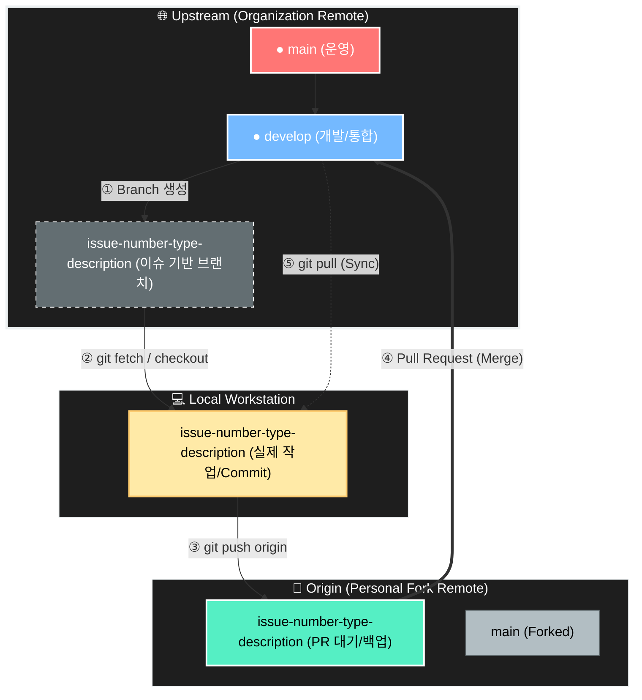
```mermaid
flowchart TD
    subgraph Upstream ["🌐 Upstream (Organization Remote)"]
        direction TB
        U_MAIN["● main (운영)"]
        U_DEV["● develop (개발/통합)"]
        U_FEAT["issue-number-type-description (이슈 기반 브랜치)"]

        U_MAIN --> U_DEV
        U_DEV -- "① Branch 생성" --> U_FEAT
    end

    subgraph Local ["💻 Local Workstation"]
        direction TB
        L_FEAT["issue-number-type-description (실제 작업/Commit)"]
    end

    subgraph Origin ["🍴 Origin (Personal Fork Remote)"]
        direction TB
        O_FEAT["issue-number-type-description (PR 대기/백업)"]
        O_MAIN["main (Forked)"]
    end

    U_FEAT -- "② git fetch / checkout" --> L_FEAT
    L_FEAT -- "③ git push origin" --> O_FEAT
    O_FEAT == "④ Pull Request (Merge)" ==> U_DEV
    U_DEV -. "⑤ git pull (Sync)" .-> L_FEAT

    style U_MAIN fill:#ff7675,stroke:#fff,stroke-width:2px,color:#fff
    style U_DEV fill:#74b9ff,stroke:#fff,stroke-width:2px,color:#fff
    style U_FEAT fill:#636e72,stroke:#fff,stroke-dasharray: 5 5,color:#fff
    style L_FEAT fill:#ffeaa7,stroke:#fdcb6e,stroke-width:2px,color:#000
    style O_FEAT fill:#55efc4,stroke:#fff,stroke-width:2px,color:#000
    style O_MAIN fill:#b2bec3,stroke:#636e72,color:#000
    style Upstream fill:#1e1e1e,stroke:#ecf0f1,stroke-width:3px,color:#fff
    style Origin fill:#1e1e1e,stroke:#ecf0f1,color:#fff
    style Local fill:#1e1e1e,stroke:#ecf0f1,color:#fff
```

> 원본 레포지토리의 안정성을 최우선으로 유지하면서, 개인 단위 자유로운 개발과 팀 단위 통제된 통합을 동시에 달성하기 위한 협업 구조입니다.

---

## Branch Workflow

> 모든 작업은 **`develop` 브랜치**를 기준으로 진행합니다.

| 구분 | 내용 |
| --- | --- |
| **기준 브랜치** | `develop` (Single Source of Truth) |
| **작업 브랜치** | 로컬 환경의 `issue-number-type-short-description` |
| **Push 대상** | `origin` (개인 Fork 레포지토리) |
| **PR 대상** | `origin/작업-브랜치` → `upstream/develop` |

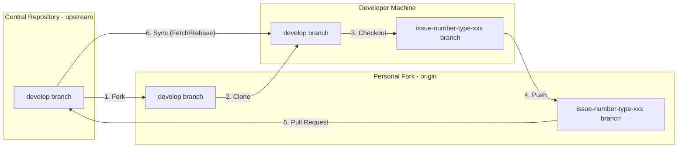
```mermaid
graph LR
    subgraph Upstream [Central Repository - upstream]
        U_Dev[develop branch]
    end

    subgraph Origin [Personal Fork - origin]
        O_Dev[develop branch]
        O_Feat[issue-number-type-xxx branch]
    end

    subgraph Local [Developer Machine]
        L_Dev[develop branch]
        L_Feat[issue-number-type-xxx branch]
    end

    U_Dev -- "1. Fork" --> O_Dev
    O_Dev -- "2. Clone" --> L_Dev
    L_Dev -- "3. Checkout" --> L_Feat
    L_Feat -- "4. Push" --> O_Feat
    O_Feat -- "5. Pull Request" --> U_Dev
    U_Dev -- "6. Sync (Fetch/Rebase)" --> L_Dev
```

---

### Branch Naming Convention

`<issue-number>-<type>-<short-description>`

| 타입 (Type) | 설명 | 예시 |
| --- | --- | --- |
| `feature` | 새로운 기능 추가 | `41-feature-video-upload-api` |
| `fix` | 버그 수정 | `52-fix-webcam-crash` |
| `hotfix` | 운영 중 발생한 긴급 버그 수정 | `hotfix/78-login-error` |
| `chore` | 설정 변경, 유지보수 등 기능 무관 작업 | `26-chore-clean-up-repository` |
| `docs` | 문서 수정 | `30-docs-update-readme` |
| `test` | 테스트 코드 추가 또는 수정 | `35-test-pose-estimator` |
| `refactor` | 기능 변경 없는 코드 구조 개선 | `44-refactor-tracker-module` |
| `ci` | CI/CD 설정 및 자동화 파이프라인 수정 | `60-ci-update-github-actions` |

---

### 커밋 컨벤션 (Commit Convention)

```
type: short summary (#<issue-number>)

- change item 1
- change item 2
- change item 3
```

| Type | Description |
| --- | --- |
| `feat` | 새로운 기능 추가 |
| `fix` | 버그 수정 |
| `docs` | 문서 수정 |
| `style` | 코드 포맷, 세미콜론 등 스타일 수정 |
| `refactor` | 기능 변경 없는 구조 개선 |
| `perf` | 성능 개선 |
| `test` | 테스트 코드 추가 또는 수정 |
| `build` | 빌드 설정 변경 |
| `ci` | CI 설정 변경 |
| `chore` | 설정, 빌드, 기타 유지보수 작업 |
| `revert` | 이전 커밋 되돌리기 |
| `repo` | 저장소 구조 변경 (아카이브, 이동, 제거) |

---

### 이슈 기반 작업 관리

- 모든 작업은 GitHub Issue 생성 후 진행
- Issue 단위로 브랜치 생성 (`issue-number-type-description`)
- 작업 범위, 완료 조건, 체크리스트를 Issue에 명시
- PR은 반드시 관련 Issue를 연결하여 생성

**이슈 타입**

| Type | Description |
| --- | --- |
| `feature` | 새로운 기능 작업 |
| `fix` | 버그 수정 |
| `refactor` | 내부 구조 개선 |
| `docs` | 문서 작업 |
| `test` | 테스트 작업 |
| `chore` | 환경 설정, 유지보수 |
| `ci` | CI/CD 작업 |
| `perf` | 성능 개선 |

---

### 코드 리뷰 프로세스

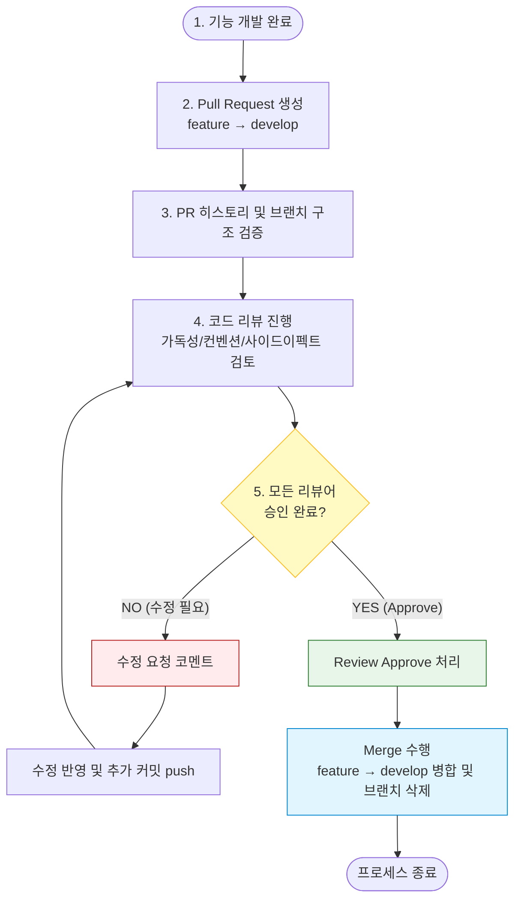
```mermaid
graph TD
    Start([1. 기능 개발 완료]) --> PR[2. Pull Request 생성<br/>feature → develop]
    PR --> Verify[3. PR 히스토리 및 브랜치 구조 검증]
    Verify --> Review[4. 코드 리뷰 진행<br/>가독성/컨벤션/사이드이펙트 검토]

    Review --> Decision{5. 모든 리뷰어<br/>승인 완료?}

    Decision -- "NO (수정 필요)" --> Feedback[수정 요청 코멘트]
    Feedback --> Fix[수정 반영 및 추가 커밋 push]
    Fix --> Review

    Decision -- "YES (Approve)" --> Approve[Review Approve 처리]
    Approve --> Merge[Merge 수행<br/>feature → develop 병합 및 브랜치 삭제]
    Merge --> End([프로세스 종료])

    style Decision fill:#fff9c4,stroke:#fbc02d
    style Feedback fill:#ffebee,stroke:#b71c1c
    style Approve fill:#e8f5e9,stroke:#2e7d32
    style Merge fill:#e1f5fe,stroke:#0288d1
```

> 코드 리뷰 시 중점 검토 사항
> - 코드 가독성 및 컨벤션 준수 여부
> - 공통 모듈 영향도
> - 사이드 이펙트 발생 가능성
> - 불필요한 중복 코드 여부

---

# 프로젝트 개요

### 프로젝트 목표와 범위

- AI 포즈 추정(MediaPipe PoseLandmarker) 기반 랙 운동 자세 분석 시스템 구현
- 컴퓨터 비전을 활용한 실시간 모션 트래킹 파이프라인 구축
- 이슈 기반 GitHub 협업 프로세스 실습 및 정착

---

### 프로젝트 범위 (Project Scope)

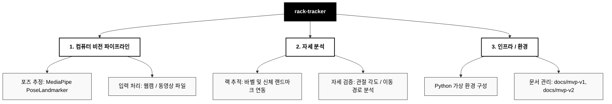
```mermaid
graph TD
    Root[<b>rack-tracker</b>]

    Root --> Vision[<b>1. 컴퓨터 비전 파이프라인</b>]
    Root --> Analysis[<b>2. 자세 분석</b>]
    Root --> Infra[<b>3. 인프라 / 환경</b>]

    Vision --> PoseEst[포즈 추정: MediaPipe PoseLandmarker]
    Vision --> VideoInput[입력 처리: 웹캠 / 동영상 파일]

    Analysis --> RackTrack[랙 추적: 바벨 및 신체 랜드마크 연동]
    Analysis --> FormCheck[자세 검증: 관절 각도 / 이동 경로 분석]

    Infra --> PythonEnv[Python 가상 환경 구성]
    Infra --> Docs[문서 관리: docs/mvp-v1, docs/mvp-v2]

    style Root fill:#000,stroke:#000,stroke-width:2px,color:#fff
    style Vision fill:#fff,stroke:#000,stroke-width:2px,color:#000
    style Analysis fill:#fff,stroke:#000,stroke-width:2px,color:#000
    style Infra fill:#fff,stroke:#000,stroke-width:2px,color:#000
    style PoseEst fill:#f9f9f9,stroke:#333,color:#000
    style VideoInput fill:#f9f9f9,stroke:#333,color:#000
    style RackTrack fill:#f9f9f9,stroke:#333,color:#000
    style FormCheck fill:#f9f9f9,stroke:#333,color:#000
    style PythonEnv fill:#f9f9f9,stroke:#333,color:#000
    style Docs fill:#f9f9f9,stroke:#333,color:#000
```

---

### 저장소 구조

| 경로 | 설명 |
| --- | --- |
| `poseLandmarker_Python/` | 메인 구현 (Python, MediaPipe) |
| `docs/mvp-v2/` | MVP v2 기획 및 이슈 추적 |
| `docs/mvp-v1/` | MVP v1 레거시 문서 참조 |
| `docs/agent-workflow/` | 협업 워크플로우 및 컨벤션 |
| `archive/` | 레거시 실험 산출물 보존 |

---

### Start Here

- 저장소 문서 인덱스: `docs/README.md`
- MVP v2 진입점: `docs/mvp-v2/README.md`
- MVP v2 이슈 추적: `docs/mvp-v2/issues/README.md`
- 협업 워크플로우: `docs/agent-workflow/README.md`

---

# 백엔드 아키텍처 (Backend Architecture)

> `poseLandmarker_Python/` — FastAPI 기반 동작 분석 백엔드

<div align="center">
  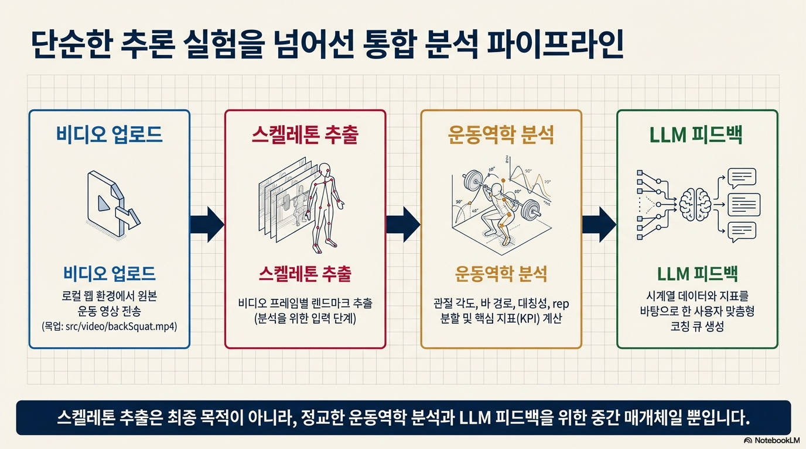
  <p><em>비디오 업로드 → 스켈레톤 추출 → 운동역학 분석 → LLM 피드백</em></p>
</div>

<div align="center">
  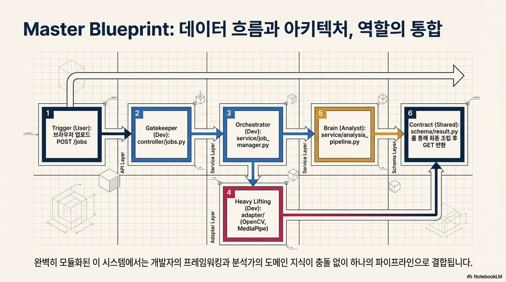
  <p><em>Master Blueprint — 데이터 흐름과 아키텍처, 역할의 통합</em></p>
</div>

---

## 6-Layer 아키텍처 스택

<div align="center">
  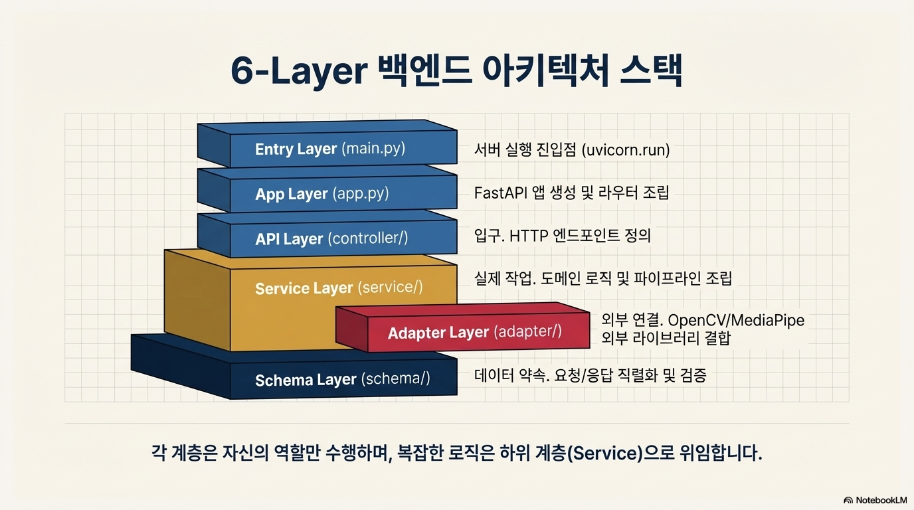
</div>

| Layer | 경로 | 역할 |
| --- | --- | --- |
| **Entry Layer** | `main.py` | uvicorn 서버 진입점 |
| **FastAPI Layer** | `app.py` | FastAPI 앱, CORS / GZip 미들웨어 |
| **API Layer** | `controller/` | 라우터, HTTP 엔드포인트, 요청 파싱 |
| **Service Layer** | `service/` | 핵심 비즈니스 로직, 파이프라인 오케스트레이션 |
| **Adapter Layer** | `adapter/` | 외부 라이브러리(OpenCV, MediaPipe) 격리 |
| **Schema Layer** | `schema/` | Pydantic 데이터 모델, 직렬화/역직렬화 |

---

## uv / FastAPI

> uv 패키지 관리 + REST API 서버

<div align="center">
  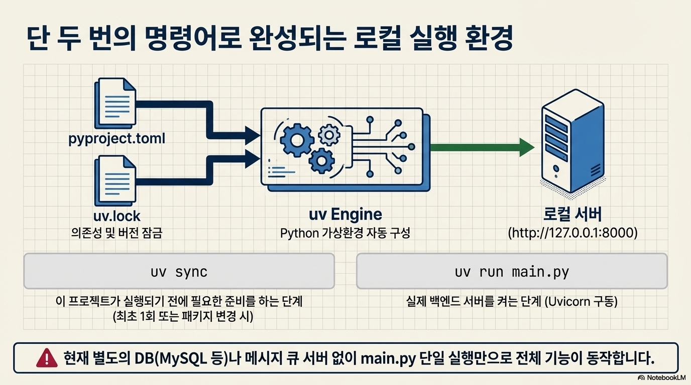
  <p><em><code>uv sync</code> → <code>uv run main.py</code> — 두 명령어로 로컬 서버 실행</em></p>
</div>

### 비동기 Job 파이프라인

영상 처리는 단일 요청-응답으로 완료할 수 없어 비동기 Job 구조를 사용합니다.

<div align="center">
  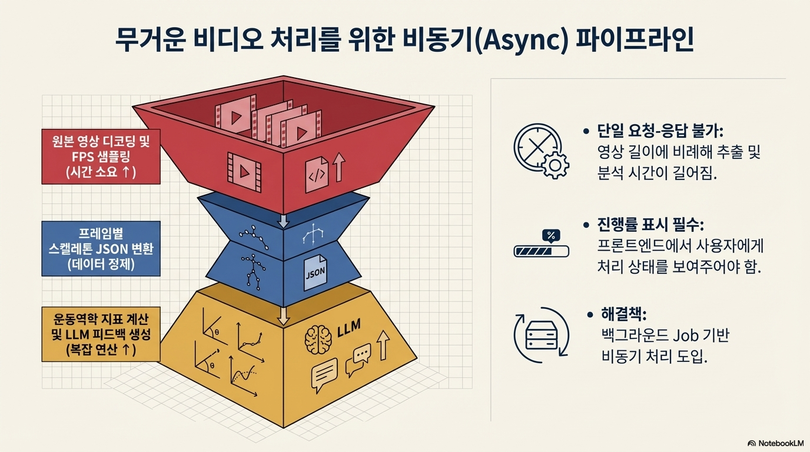
</div>

### Job State Machine

<div align="center">
  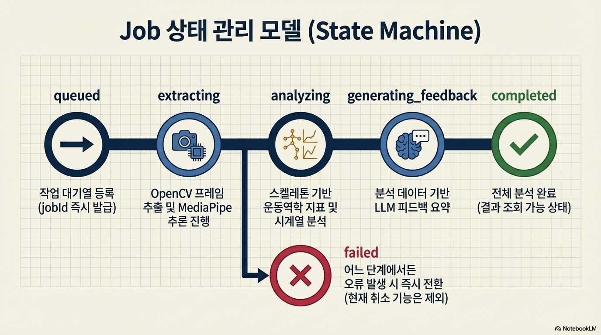
</div>

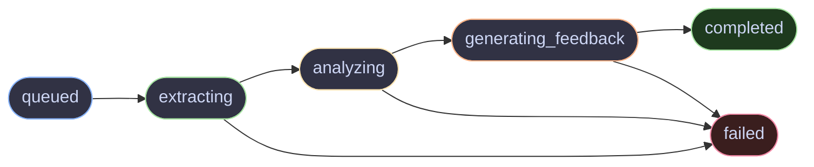
```mermaid
flowchart LR
    Q([queued]) --> E([extracting]) --> A([analyzing]) --> G([generating_feedback]) --> C([completed])
    E & A & G --> F([failed])

    style Q fill:#313244,stroke:#89b4fa,color:#cdd6f4
    style E fill:#313244,stroke:#a6e3a1,color:#cdd6f4
    style A fill:#313244,stroke:#f9e2af,color:#cdd6f4
    style G fill:#313244,stroke:#fab387,color:#cdd6f4
    style C fill:#1e3a1e,stroke:#a6e3a1,color:#cdd6f4
    style F fill:#3a1e1e,stroke:#f38ba8,color:#cdd6f4
```

### 프론트엔드-백엔드 Polling 통신 규약

<div align="center">
  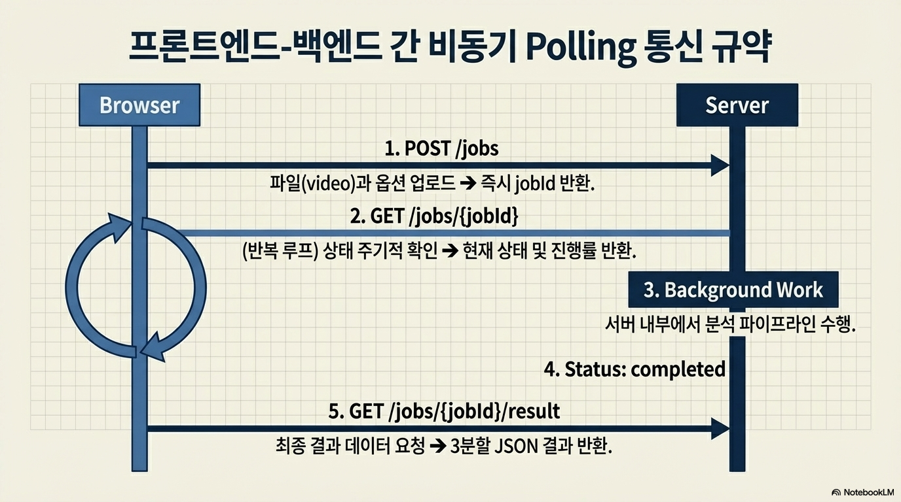
</div>

| 엔드포인트 | 설명 |
| --- | --- |
| `POST /jobs` | 영상 업로드 → job_id 즉시 반환 |
| `GET /jobs/{job_id}` | 상태 폴링 (반복 루프) → 진행 상태 및 현재 단계 반환 |
| `GET /jobs/{job_id}/result` | 최종 결과 JSON 반환 |
| `POST /analysis/preview` | 동기 즉시 분석 (업로드 없이 샘플 영상 사용) |

### Service Layer 오케스트레이션

<div align="center">
  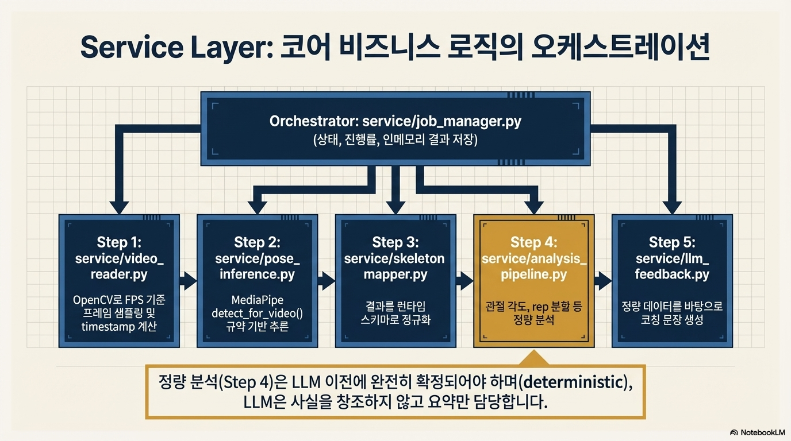
</div>

`service/job_manager.py`가 Orchestrator로서 전체 5단계 파이프라인을 순차 실행합니다.

| Step | 서비스 | 역할 |
| --- | --- | --- |
| 1 | `video_reader.py` | OpenCV 프레임 추출 |
| 2 | `pose_inference.py` + `mediapipe_adapter.py` | MediaPipe 포즈 추론 |
| 3 | `skeleton_mapper.py` | 스켈레톤 JSON 변환 |
| 4 | `analysis_pipeline.py` | 운동역학 분석 전체 실행 |
| 5 | `llm_feedback.py` | LLM 피드백 생성 |

### 3분할 데이터 계약

<div align="center">
  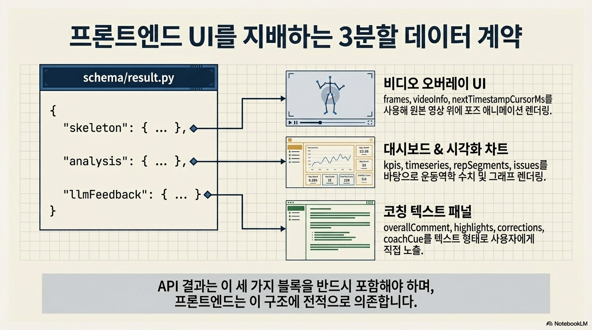
</div>

`schema/result.py`의 응답 구조는 세 블록으로 구성됩니다.

```
{
  "skeleton": { ... },    // 비디오 오버레이 UI용 프레임별 랜드마크
  "analysis": { ... },    // 대시보드 시각화 차트용 KPI · repSegments · issues
  "llmFeedback": { ... }  // 코칭 텍스트 패널 (overallComment, highlights, corrections, coachCue)
}
```

---

## OpenCV

> 비디오 프레임 추출 레이어 — 영상 분석 공정의 첫 번째 관문

<div align="center">
  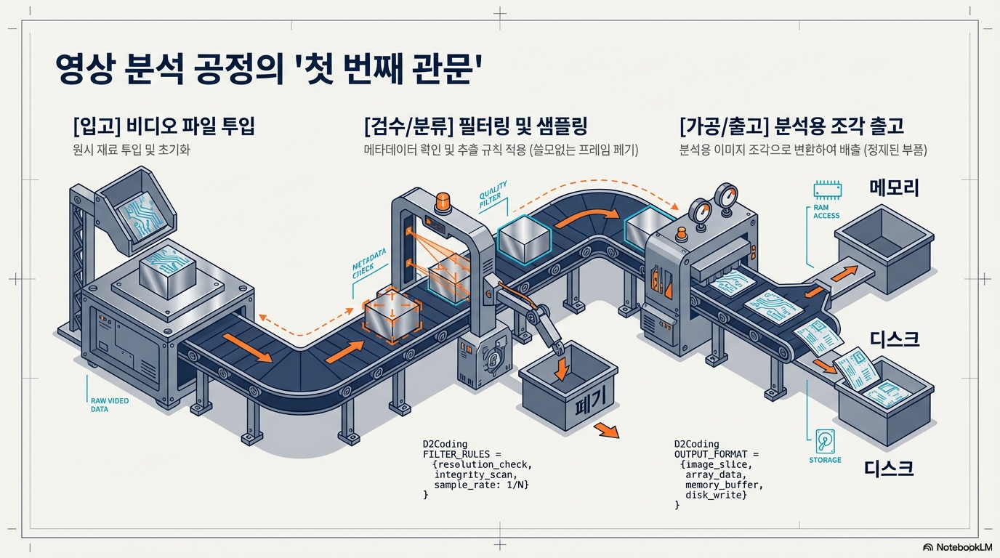
</div>

### 3가지 핵심 설계 원칙

<div align="center">
  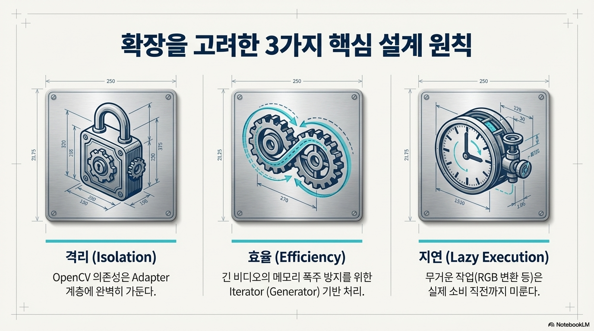
</div>

| 원칙 | 설명 |
| --- | --- |
| **격리 (Isolation)** | `OpenCvAdapter`로 외부 라이브러리를 Service 계층과 분리 |
| **효율 (Efficiency)** | Iterator(Generator) 기반 지연 처리로 메모리 부담 최소화 |
| **지연 (Lazy Execution)** | 프레임을 실제 소비 시점까지 디코딩 지연 |

### 책임 분리 구조

<div align="center">
  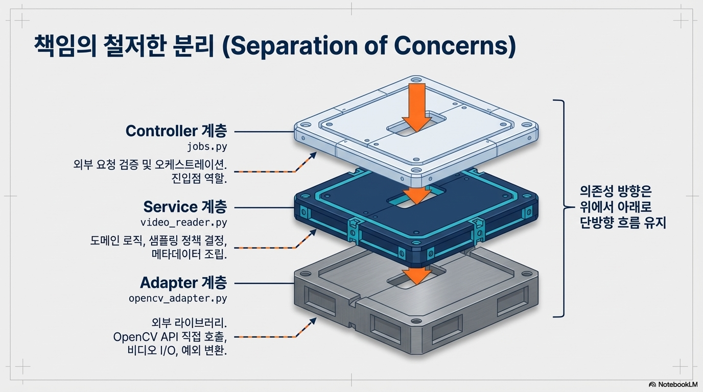
</div>

### 형태 변환 흐름

<div align="center">
  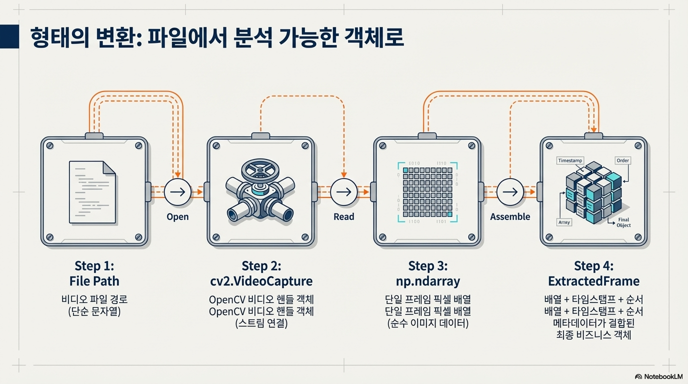
</div>

`File Path` → `cv2.VideoCapture` → `np.ndarray` → `ExtractedFrame`

### 샘플링 전략 (Sampling Strategies)

<div align="center">
  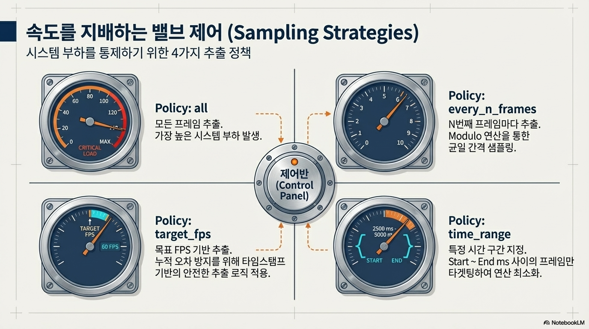
</div>

| 모드 | 설명 |
| --- | --- |
| `all` | 모든 프레임 발행 |
| `every_n_frames` | N번째 프레임마다 추출 |
| `target_fps` | 목표 FPS 기반 균등 샘플링 |
| `time_range` | 특정 시간 구간 내 프레임만 추출 |

### 입출력 스키마

<div align="center">
  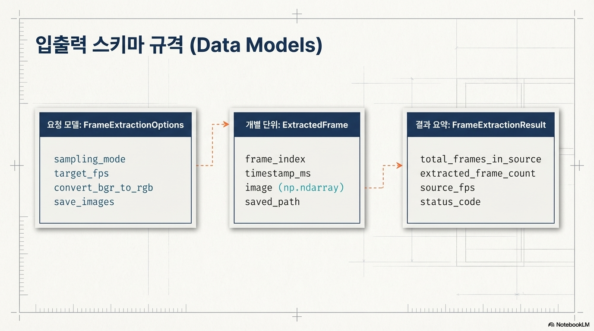
</div>

| 모델 | 주요 필드 |
| --- | --- |
| `FrameExtractionOptions` | `sampling_mode`, `target_fps`, `convert_bgr_to_rgb`, `save_images` |
| `ExtractedFrame` | `frame_index`, `timestamp_ms`, `image (np.ndarray)`, `saved_path` |
| `FrameExtractionResult` | `total_frames_in_source`, `extracted_frame_count`, `status_code` |

---

## MediaPipe

> 포즈 추정(Pose Estimation) 레이어

<div align="center">
  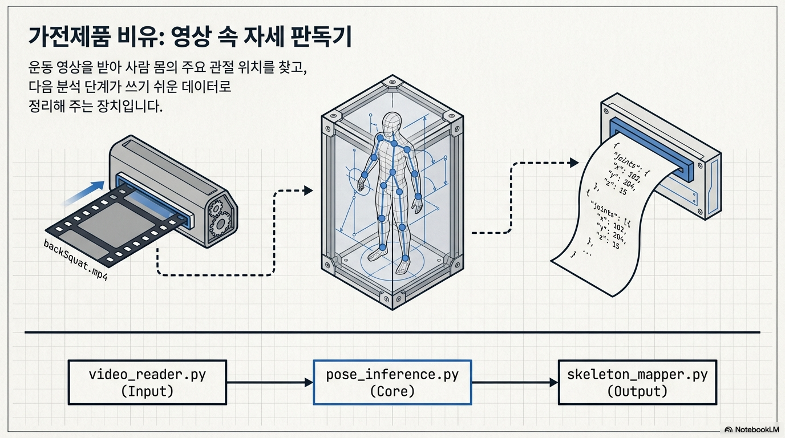
  <p><em>video_reader.py (Input) → pose_inference.py (Core) → skeleton_mapper.py (Output)</em></p>
</div>

### 백엔드 조립 라인에서의 위치

<div align="center">
  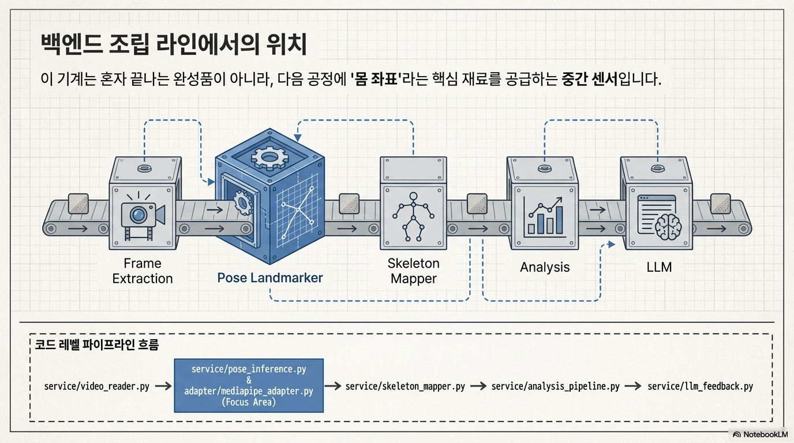
</div>

### 데이터 형태 변화 흐름

<div align="center">
  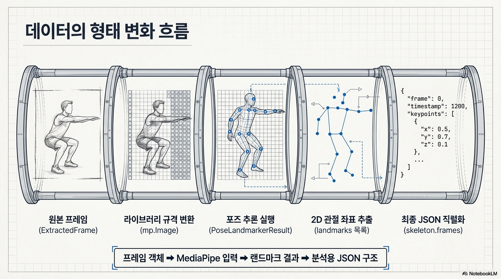
</div>

`ExtractedFrame` → `mp.Image` 변환 → `PoseLandmarkerResult` → 33개 관절 좌표 추출 → Skeleton JSON

### Adapter Pattern — 복잡성 격리

<div align="center">
  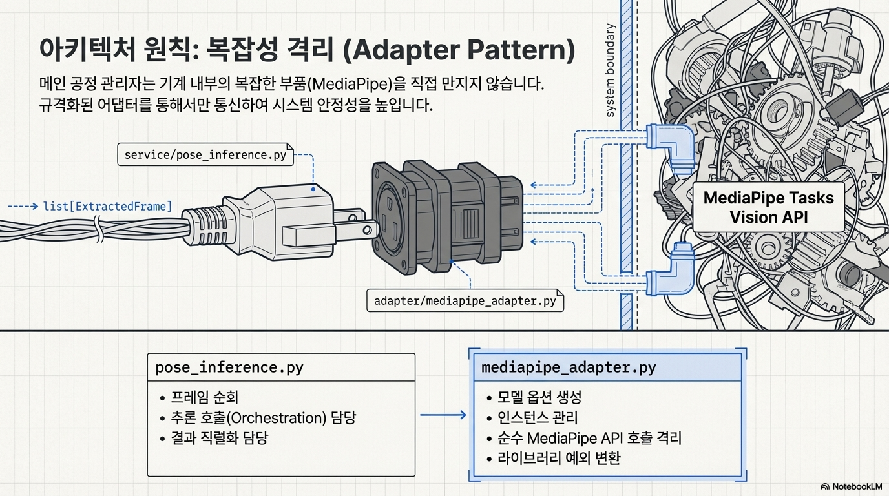
</div>

| 파일 | 역할 |
| --- | --- |
| `service/pose_inference.py` | 추론 흐름(Orchestration) 담당, 결과 직렬화 |
| `adapter/mediapipe_adapter.py` | MediaPipe Vision API 직접 호출, 초기화·종료 관리 |

### 모델 변형 (Model Variant) 비교

<div align="center">
  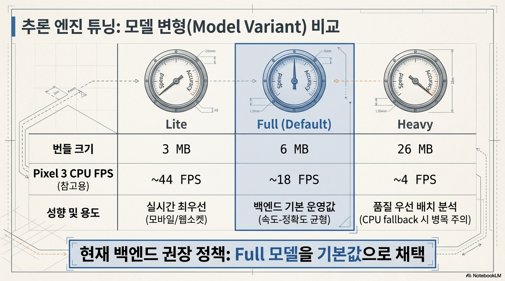
</div>

| Variant | 번들 크기 | Pixel 3 CPU FPS | 특징 |
| :---: | :---: | :---: | --- |
| Lite | 3 MB | ~44 FPS | 실시간 처리 우선 |
| **Full** (기본값) | 6 MB | ~18 FPS | 백엔드 기본 운용값 |
| Heavy | 26 MB | ~4 FPS | 정밀 배치 분석 |

### GPU → CPU Fallback 정책

<div align="center">
  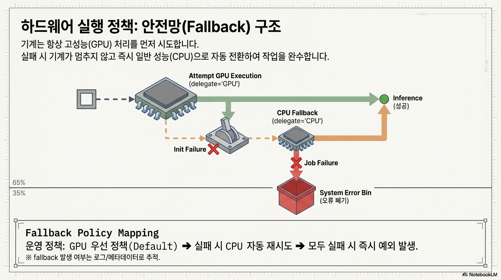
</div>

GPU 초기화 실패 시 CPU로 자동 전환하며, `delegate_fallback_applied` 플래그로 추적합니다.

### 마스터 아키텍처 청사진

<div align="center">
  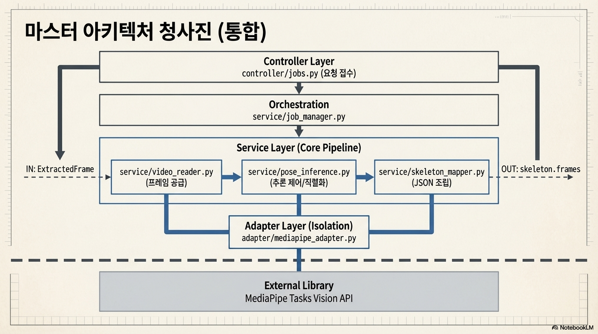
</div>

---

## 데이터 분석 파이프라인

> Skeleton JSON → 자세 분석 결과 — LLM 없이도 독립적으로 동작하는 Biomechanics Engine

<div align="center">
  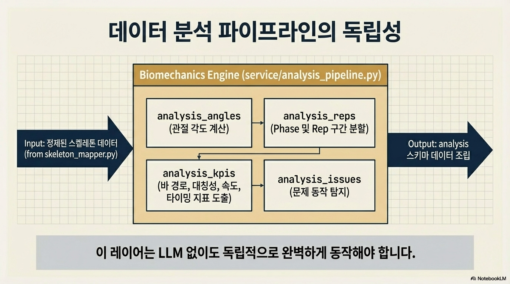
</div>

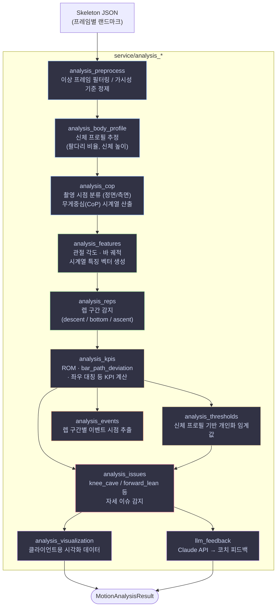
```mermaid
flowchart TD
    Skeleton["Skeleton JSON\n(프레임별 랜드마크)"]

    subgraph Pipeline ["service/analysis_*"]
        Preprocess["analysis_preprocess\n이상 프레임 필터링 / 가시성 기준 정제"]
        BodyProfile["analysis_body_profile\n신체 프로필 추정\n(팔다리 비율, 신체 높이)"]
        COP["analysis_cop\n촬영 시점 분류 (정면/측면)\n무게중심(CoP) 시계열 산출"]
        Features["analysis_features\n관절 각도 · 바 궤적\n시계열 특징 벡터 생성"]
        Reps["analysis_reps\n렙 구간 감지\n(descent / bottom / ascent)"]
        KPIs["analysis_kpis\nROM · bar_path_deviation\n· 좌우 대칭 등 KPI 계산"]
        Thresholds["analysis_thresholds\n신체 프로필 기반 개인화 임계값"]
        Events["analysis_events\n렙 구간별 이벤트 시점 추출"]
        Issues["analysis_issues\nknee_cave / forward_lean 등\n자세 이슈 감지"]
        Viz["analysis_visualization\n클라이언트용 시각화 데이터"]
        LLM["llm_feedback\nClaude API → 코치 피드백"]
    end

    Result(["MotionAnalysisResult"])

    Skeleton --> Preprocess --> BodyProfile --> COP --> Features
    Features --> Reps --> KPIs --> Thresholds
    KPIs --> Events
    KPIs & Thresholds --> Issues --> Viz & LLM
    Viz & LLM --> Result

    style Preprocess fill:#313244,stroke:#89b4fa,color:#cdd6f4
    style BodyProfile fill:#313244,stroke:#89b4fa,color:#cdd6f4
    style COP fill:#313244,stroke:#89b4fa,color:#cdd6f4
    style Features fill:#313244,stroke:#a6e3a1,color:#cdd6f4
    style Reps fill:#313244,stroke:#a6e3a1,color:#cdd6f4
    style KPIs fill:#313244,stroke:#f9e2af,color:#cdd6f4
    style Thresholds fill:#313244,stroke:#f9e2af,color:#cdd6f4
    style Events fill:#313244,stroke:#fab387,color:#cdd6f4
    style Issues fill:#313244,stroke:#f38ba8,color:#cdd6f4
    style Viz fill:#313244,stroke:#cba6f7,color:#cdd6f4
    style LLM fill:#313244,stroke:#cba6f7,color:#cdd6f4
```

| 파일 | 역할 |
| --- | --- |
| `analysis_preprocess.py` | 가시성 임계값 이하 프레임 정제, 이상 프레임 마킹 |
| `analysis_body_profile.py` | 팔다리 비율 · 신체 높이 추정으로 개인 신체 프로필 생성 |
| `analysis_cop.py` | 촬영 시점 분류(정면/측면), 무게중심(CoP) 시계열 산출 |
| `analysis_features.py` | 관절 각도, 바 궤적, 좌우 대칭 등 시계열 특징 벡터 추출 |
| `analysis_reps.py` | 하강·최저점·상승 구간 감지, 렙 세그먼트 분리 |
| `analysis_kpis.py` | ROM, 바 경로 편차 등 핵심 KPI 계산 |
| `analysis_thresholds.py` | 신체 프로필 기반 개인화 자세 임계값 산출 |
| `analysis_events.py` | 렙 구간별 주요 이벤트 시점 추출 |
| `analysis_issues.py` | knee_cave, forward_lean 등 자세 이슈 판정 |
| `analysis_visualization.py` | 클라이언트용 시각화 오버레이 데이터 생성 |
| `llm_feedback.py` | Claude API 호출 → 강점 / 교정 / 코치 큐 생성 |

---

## 팀 역할 매트릭스

<div align="center">
  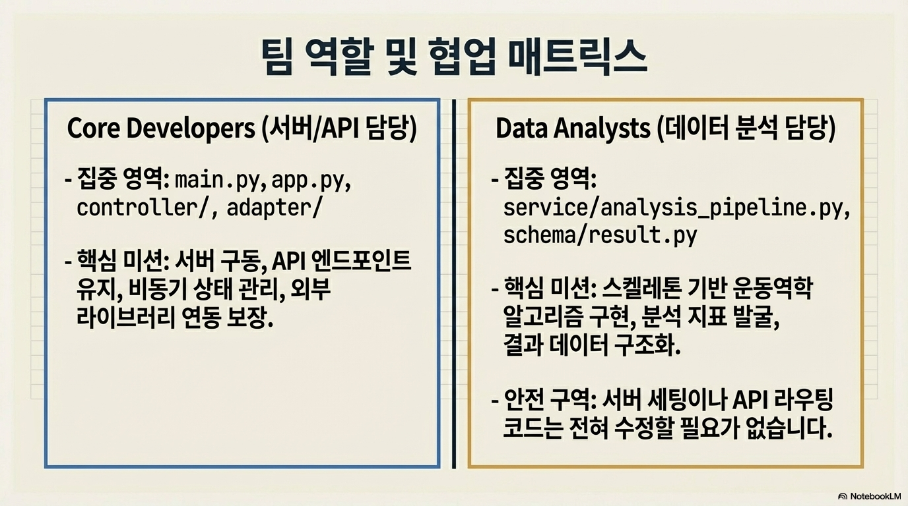
</div>

| 역할 | 집중 영역 | 핵심 파일 |
| --- | --- | --- |
| **Core Developer** | 서버/API 담당 — API 엔드포인트, 비동기 상태 관리, 외부 라이브러리 연동 | `main.py`, `app.py`, `controller/`, `adapter/` |
| **Data Analyst** | 데이터 분석 담당 — 스켈레톤 기반 운동역학 알고리즘 구현, 분석 지표 발굴 | `service/analysis_pipeline.py`, `schema/result.py` |
