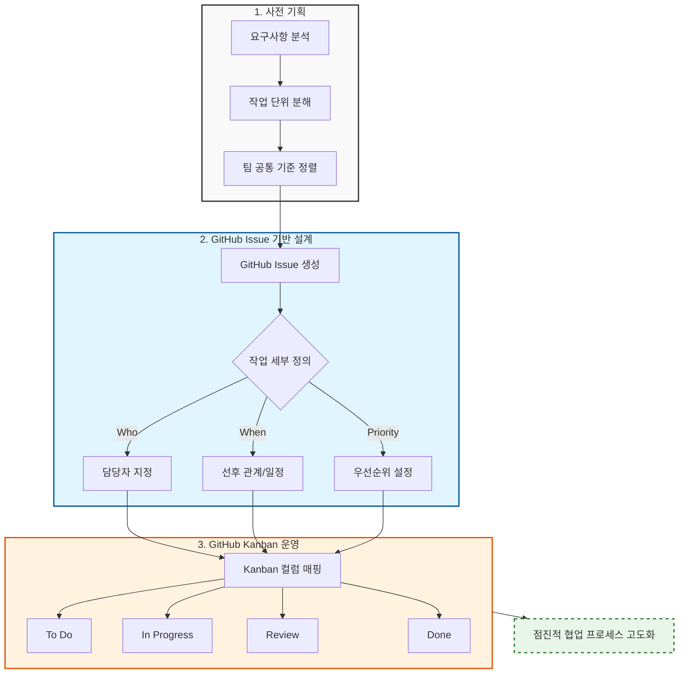
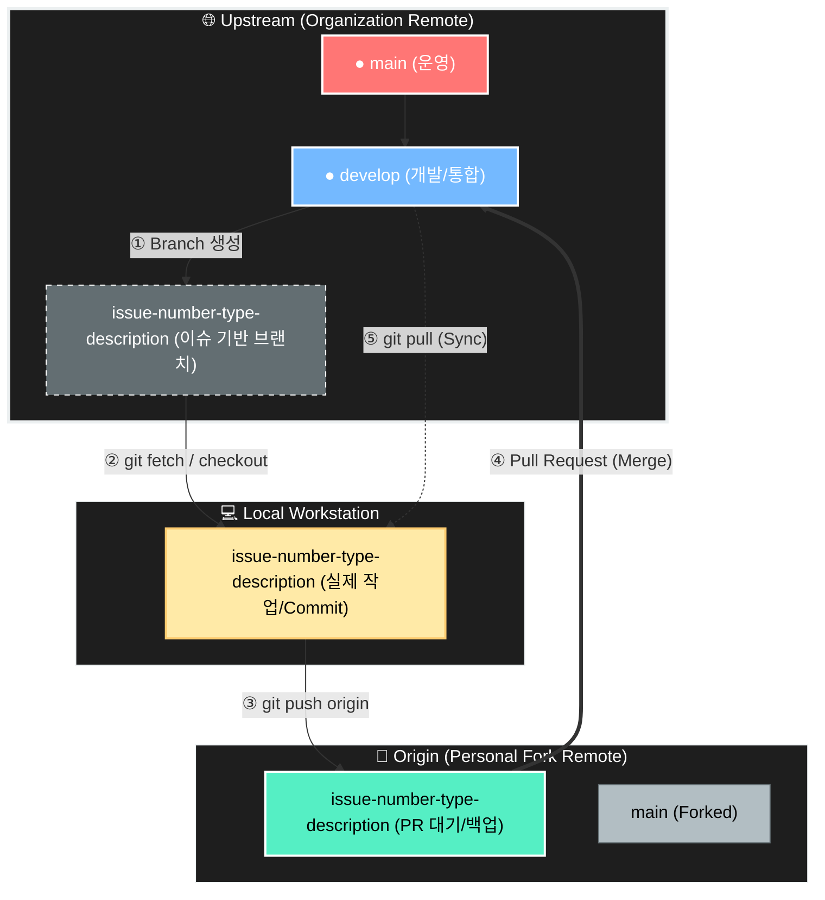
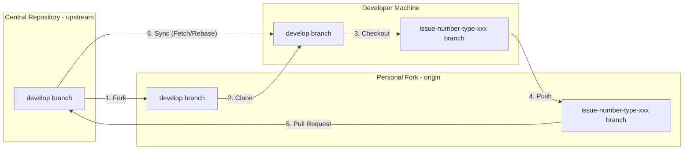
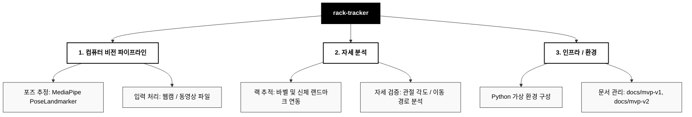
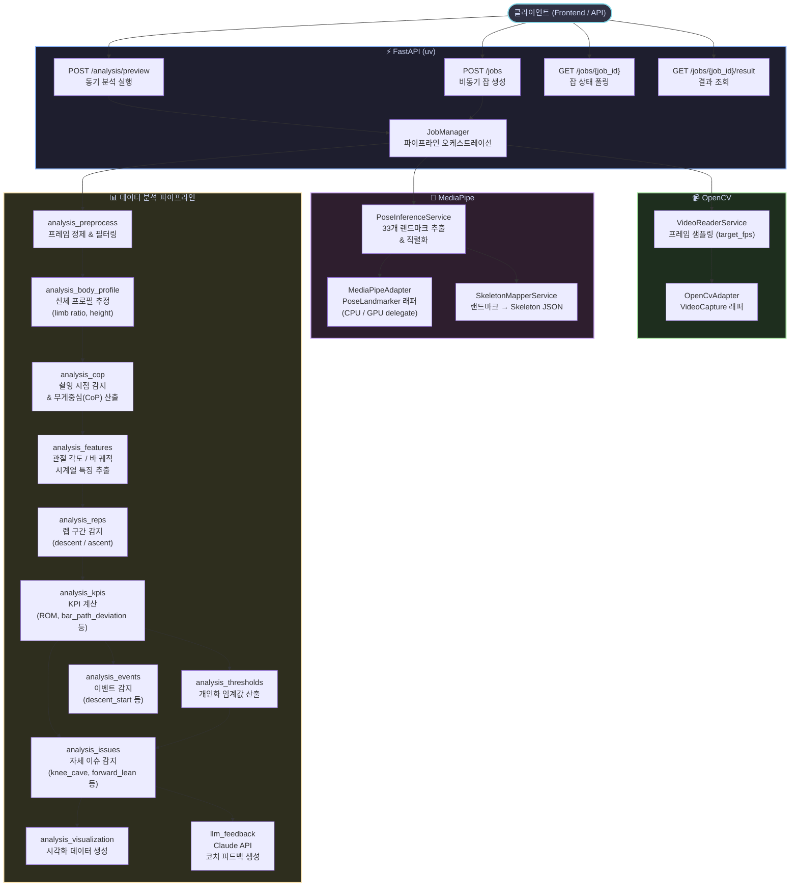
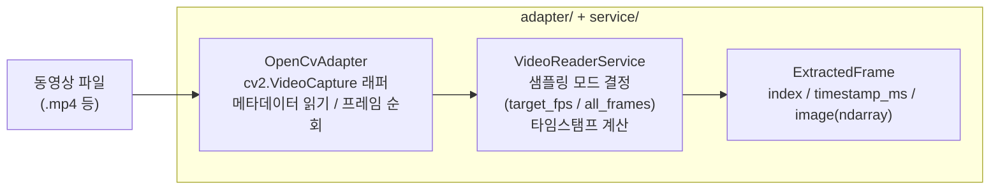
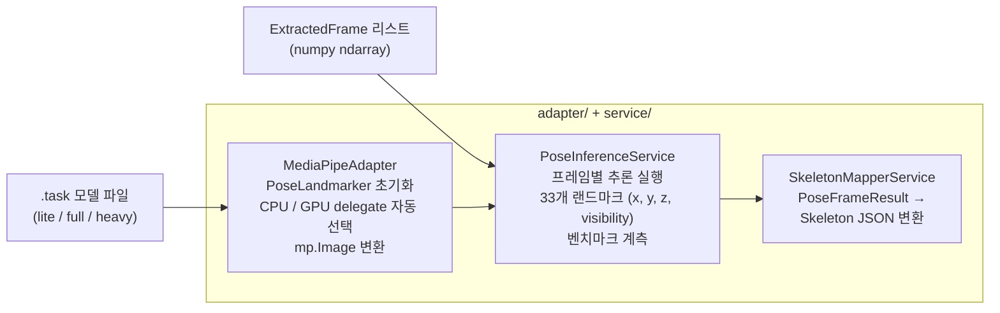
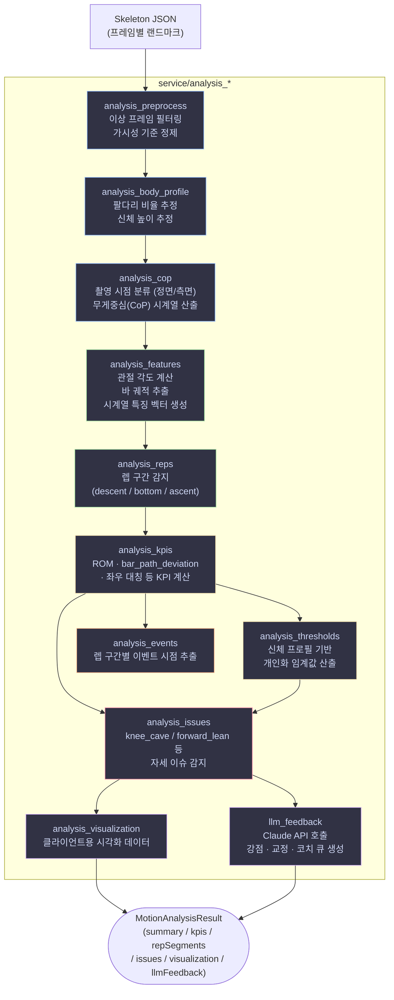

# [AI 기반 랙 운동 자세 추적 및 분석 프로젝트]

> 컴퓨터 비전과 AI 포즈 추정을 활용한 랙 기반 근력 운동 모션 트래킹 시스템

---

# 팀 구성 및 역할 분담

## 팀원 소개 및 역할

| 프로필 | 이름 | 담당 영역 | 핵심 책임 | 주요 개발 산출물 |
| :---: | :--- | :--- | :--- | :--- |
|  | **이&nbsp;현&nbsp;규** | Core / AI | 프로젝트 리드, 포즈 추정 파이프라인 설계 및 구현, 협업 시스템 구축 | PoseLandmarker 통합, 랙 추적 알고리즘, 문서 체계 수립 |
| — | **이&nbsp;지&nbsp;원** | | | |
| — | **장&nbsp;효&nbsp;인** | | | |
| — | **전&nbsp;효&nbsp;원** | | | |
| — | **신&nbsp;은&nbsp;수** | | | |

---

# 프로젝트 관리 (Collaboration & Process)



> 본 프로젝트는 AI 기능 구현과 더불어, 이슈 기반 GitHub 협업 시스템을 실제로 설계하고 운영하는 과정을 중점적으로 다룹니다.

---

# 협업 프로세스 (Collaboration Process)

## Collaboration Strategy & Philosophy

### Convention First, Code Later

기능 개발에 앞서 협업의 토대를 먼저 견고히 합니다. 저장소 생성 직후, 브랜치 전략과 커밋 컨벤션을 먼저 확정하고 문서화합니다.

- **브랜치 전략:** 이슈 번호 기반 브랜치 생성, `develop` 브랜치 중심 통합
- **커밋 규칙:** 타입 기반 커밋 메시지로 변경 의도 명확화
- **PR 프로세스:** 모든 변경은 PR을 통해 공유, 리뷰 승인 후 병합

---

# Repository Architecture



> 원본 레포지토리의 안정성을 최우선으로 유지하면서, 개인 단위 자유로운 개발과 팀 단위 통제된 통합을 동시에 달성하기 위한 협업 구조입니다.

---

## Branch Workflow

> 모든 작업은 **`develop` 브랜치**를 기준으로 진행합니다.

| 구분 | 내용 |
| --- | --- |
| **기준 브랜치** | `develop` (Single Source of Truth) |
| **작업 브랜치** | 로컬 환경의 `issue-number-type-short-description` |
| **Push 대상** | `origin` (개인 Fork 레포지토리) |
| **PR 대상** | `origin/작업-브랜치` → `upstream/develop` |



---

### Branch Naming Convention

`<issue-number>-<type>-<short-description>`

| 타입 (Type) | 설명 | 예시 |
| --- | --- | --- |
| `feature` | 새로운 기능 추가 | `41-feature-video-upload-api` |
| `fix` | 버그 수정 | `52-fix-webcam-crash` |
| `hotfix` | 운영 중 발생한 긴급 버그 수정 | `hotfix/78-login-error` |
| `chore` | 설정 변경, 유지보수 등 기능 무관 작업 | `26-chore-clean-up-repository` |
| `docs` | 문서 수정 | `30-docs-update-readme` |
| `test` | 테스트 코드 추가 또는 수정 | `35-test-pose-estimator` |
| `refactor` | 기능 변경 없는 코드 구조 개선 | `44-refactor-tracker-module` |
| `ci` | CI/CD 설정 및 자동화 파이프라인 수정 | `60-ci-update-github-actions` |

---

### 커밋 컨벤션 (Commit Convention)

```
type: short summary (#<issue-number>)

- change item 1
- change item 2
- change item 3
```

| Type | Description |
| --- | --- |
| `feat` | 새로운 기능 추가 |
| `fix` | 버그 수정 |
| `docs` | 문서 수정 |
| `style` | 코드 포맷, 세미콜론 등 스타일 수정 |
| `refactor` | 기능 변경 없는 구조 개선 |
| `perf` | 성능 개선 |
| `test` | 테스트 코드 추가 또는 수정 |
| `build` | 빌드 설정 변경 |
| `ci` | CI 설정 변경 |
| `chore` | 설정, 빌드, 기타 유지보수 작업 |
| `revert` | 이전 커밋 되돌리기 |
| `repo` | 저장소 구조 변경 (아카이브, 이동, 제거) |

---

### 이슈 기반 작업 관리

- 모든 작업은 GitHub Issue 생성 후 진행
- Issue 단위로 브랜치 생성 (`issue-number-type-description`)
- 작업 범위, 완료 조건, 체크리스트를 Issue에 명시
- PR은 반드시 관련 Issue를 연결하여 생성

**이슈 타입**

| Type | Description |
| --- | --- |
| `feature` | 새로운 기능 작업 |
| `fix` | 버그 수정 |
| `refactor` | 내부 구조 개선 |
| `docs` | 문서 작업 |
| `test` | 테스트 작업 |
| `chore` | 환경 설정, 유지보수 |
| `ci` | CI/CD 작업 |
| `perf` | 성능 개선 |

---

### 코드 리뷰 프로세스


> 코드 리뷰 시 중점 검토 사항
> - 코드 가독성 및 컨벤션 준수 여부
> - 공통 모듈 영향도
> - 사이드 이펙트 발생 가능성
> - 불필요한 중복 코드 여부

---

# 프로젝트 개요

### 프로젝트 목표와 범위

- AI 포즈 추정(MediaPipe PoseLandmarker) 기반 랙 운동 자세 분석 시스템 구현
- 컴퓨터 비전을 활용한 실시간 모션 트래킹 파이프라인 구축
- 이슈 기반 GitHub 협업 프로세스 실습 및 정착

---

### 프로젝트 범위 (Project Scope)



---

### 저장소 구조

| 경로 | 설명 |
| --- | --- |
| `poseLandmarker_Python/` | 메인 구현 (Python, MediaPipe) |
| `docs/mvp-v2/` | MVP v2 기획 및 이슈 추적 |
| `docs/mvp-v1/` | MVP v1 레거시 문서 참조 |
| `docs/agent-workflow/` | 협업 워크플로우 및 컨벤션 |
| `archive/` | 레거시 실험 산출물 보존 |

---

### Start Here

- 저장소 문서 인덱스: `docs/README.md`
- MVP v2 진입점: `docs/mvp-v2/README.md`
- MVP v2 이슈 추적: `docs/mvp-v2/issues/README.md`
- 협업 워크플로우: `docs/agent-workflow/README.md`

---

# 백엔드 아키텍처 (Backend Architecture)

> `poseLandmarker_Python/` — FastAPI 기반 동작 분석 백엔드



---

## uv / FastAPI

> 패키지 관리(uv) + REST API 서버

```mermaid
flowchart LR
    subgraph Entry ["진입점"]
        Main["main.py\nuvicorn 실행"]
        AppPy["app.py\nFastAPI 앱 초기화\nCORS / GZip 미들웨어"]
    end

    subgraph Routers ["controller/"]
        R1["analysis.py\nPOST /analysis/preview"]
        R2["jobs.py\nPOST /jobs\nGET /jobs/{id}"]
        R3["results.py\nGET /jobs/{id}/result"]
        R4["health.py\nGET /health"]
    end

    subgraph Schema ["schema/ (Pydantic)"]
        S1["frame.py\nExtractedFrame\nFrameExtractionOptions"]
        S2["pose.py\nPoseInferenceOptions\nPoseLandmarkPoint"]
        S3["job.py\nJobCreateResponse\nJobStatusResponse"]
        S4["result.py\nMotionAnalysisResult\nMotionAnalysisSummary"]
    end

    Main --> AppPy --> Routers
    Routers --> Schema
```



| 파일 | 역할 |
| --- | --- |
| `main.py` | uvicorn 서버 진입점 |
| `app.py` | FastAPI 앱, CORS / GZip 미들웨어 등록 |
| `controller/analysis.py` | `POST /analysis/preview` — 동기 분석 실행 |
| `controller/jobs.py` | `POST /jobs` — 비동기 잡 생성, `GET /jobs/{id}` — 상태 폴링 |
| `controller/results.py` | `GET /jobs/{id}/result` — 최종 결과 조회 |
| `service/job_manager.py` | 전체 파이프라인 오케스트레이션 |
| `schema/` | Pydantic 요청/응답 모델 |
| `pyproject.toml` | uv 의존성 관리 (`fastapi`, `uvicorn`, `pydantic` 등) |

---

## OpenCV

> 비디오 프레임 추출 레이어



| 파일 | 역할 |
| --- | --- |
| `adapter/opencv_adapter.py` | `cv2.VideoCapture` 래퍼, fps / 해상도 / 프레임 수 메타데이터 제공 |
| `service/video_reader.py` | 샘플링 모드(`target_fps` / `all_frames`)에 따른 프레임 필터링 및 `ExtractedFrame` 생성 |

---

## MediaPipe

> 포즈 추정(Pose Estimation) 레이어



| 파일 | 역할 |
| --- | --- |
| `adapter/mediapipe_adapter.py` | `PoseLandmarker` 생성/해제, CPU·GPU delegate 자동 폴백, `mp.Image` 변환 |
| `service/pose_inference.py` | 프레임 배치 추론, 33개 랜드마크 직렬화, 추론 벤치마크 기록 |
| `service/skeleton_mapper.py` | 추론 결과를 분석 파이프라인이 소비하는 Skeleton JSON 포맷으로 변환 |

---

## 데이터 분석 파이프라인

> Skeleton JSON → 자세 분석 결과



| 파일 | 역할 |
| --- | --- |
| `analysis_preprocess.py` | 가시성 임계값 이하 프레임 정제, 이상 프레임 마킹 |
| `analysis_body_profile.py` | 팔다리 비율 · 신체 높이 추정으로 개인 신체 프로필 생성 |
| `analysis_cop.py` | 촬영 시점 분류(정면/측면), 무게중심(CoP) 시계열 산출 |
| `analysis_features.py` | 관절 각도, 바 궤적, 좌우 대칭 등 시계열 특징 벡터 추출 |
| `analysis_reps.py` | 하강·최저점·상승 구간 감지, 렙 세그먼트 분리 |
| `analysis_kpis.py` | ROM, 바 경로 편차, 속도 등 핵심 KPI 계산 |
| `analysis_thresholds.py` | 신체 프로필 기반 개인화 자세 임계값 산출 |
| `analysis_events.py` | 렙 구간별 주요 이벤트 시점(descent_start 등) 추출 |
| `analysis_issues.py` | knee_cave, forward_lean 등 자세 이슈 판정 |
| `analysis_visualization.py` | 클라이언트용 시각화 오버레이 데이터 생성 |
| `llm_feedback.py` | Claude API 호출 → 강점 / 교정 / 코치 큐 생성 |
